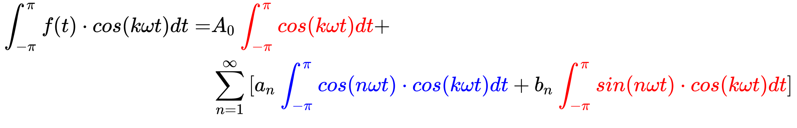
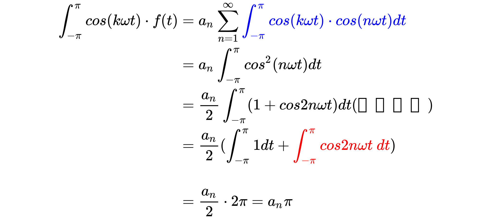

## Fourier Series

=A_0+\sum_{n=1}^{\infty}a_{n}\cos{(n\omega{t})}+b_{n}\sin{(n\omega{t})})  

 

---

### 1、麦克劳林待定系数法：
- 泰勒级数：  
任意函数可由一个多项式来逼近：

  

=A_0+A_{1}x+A_{2}x^2+A_{3}x^3...)  

- 麦克劳林：

  

=A_{1}+2A_{2}x+3A_{3}x^2...)  
=2A_{2}+6A_{3}x...)  
......

- 待定系数法解系数：  

  

,A_{1}=f'(0),A_{2}=f''(0)/2,...)  
}(0)/n!)  

---

### 2、三角函数的正交性：
- 三角函数系:  
  
**任意两个不同**函数的乘积在区间上的积分都等于0，即这两个函数在区间上正交：

  

}dx=0)  
}dx=0)   
}\cdot\sin{(kx)}dx=0)  
}\cdot\cos{(kx)}dx=0)  
}\cdot\sin{(kx)}dx=0,)  
其中,n\not=k)

- 验证：  

  
  
}\cdot\cos{(kx)}dx=\frac{1}{2}[\cos{(k+n)x}+\cos{(k-n)x}])  
}\cdot\sin{(kx)}dx=-\frac{1}{2}[\cos{(k+n)x}-\cos{(k-n)x}])  
}\cdot\sin{(kx)}dx=\frac{1}{2}[\cos{(k+n)x}+\cos{(k-n)x}])

当 时：  

---  

### 3、函数展开成傅里叶级数：
- 傅里叶级数：

=A_0+\sum_{n=1}^{\infty}a_{n}\cos{(n\omega{t})}+b_{n}\sin{(n\omega{t})})  

  

对傅里叶级数在[-π, π]范围积分，得：  

  

解得:  
)  

用)乘傅里叶级数等号两边得：  
  
然后对上式进行[-π, π]范围积分：  

  
根据三角函数系的正交性，红色积分为0，蓝色项中仅当 [公式] 时积分不为0，其余项积分为0，所以有：
  

解得：  
f(t)dt,(k\not=n))  
同理用得：  
f(t)dt,(k\not=n))  

---

### 4、复指数形式的傅里叶级数：

- 欧拉公式：  

=\frac{e^{in\omega{t}+e^{-in\omega{t}}}}{2})  
=\frac{e^{in\omega{t}-e^{-in\omega{t}}}}{2i})  

 

带入傅里叶级数：

=a_0+\sum_{n=1}^{\infty}[\frac{a_n-ib_n}{2}e^{in\omega{t}}+\frac{a_n+ib_n}{2}e^{-in\omega{t}}])  

 
可得：  

=\sum_{n=-\infty}^{\infty}c_{n}e^{-in\omega\{t}})  

 

其中称为离散频谱：

e^{-in\omega\{t}}dt)  

 