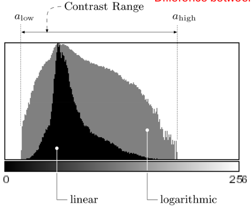
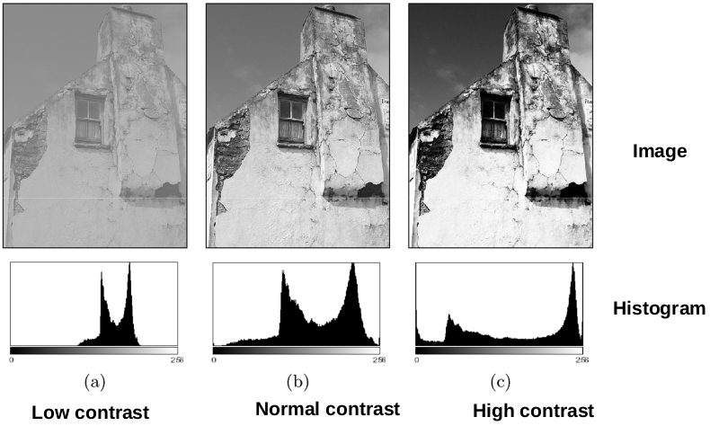

## Histograms and Point Operations

---
- **Histograms plots how many times (frequency) each intensity value in image occurs**

    
     
    
01. histograms example

**Histograms: only statistical information.**  
**No indication of location of pixels**

    
     
    
02. histograms example

**Different images can have same histogram.**
- 3 images below have same histogram

    
     
    
03. histograms example

**Can not reconstruct image from histogram.**

### a histogram for a grayscale image with intensity values in range:

\in[0,k-1]) 

 

would contain exactly *K* entries  
Each histogram entry is defined as:  
- h(i) = number of pixels with intensity I for all 0 < i < K.  
or 
=card\left\{(u,v)|I(u,v)=i\right\})  
*card* means that "Number (size of set) of pixels", and "|" is "such that".

**Log scale makes low values more visible**

    
     
    
04. Interpreting Histograms

- **contrast range**: Difference between darkest and lightest

Histograms help detect image acquisition issues Problems with image can be identified on histogram:
- Over and under exposure
- Brightness
- Contrast
- Dynamic Range

Point operations can be used to alter histogram. E.g
- Addition
- Multiplication
- Exp and Log
- Intensity Windowing (Contrast Modification)

### Image Brightness
Brightness of a grayscale image is the **average
intensity** of all pixels in image:

=\frac{1}{w*h}\sum_{v=1}^{h}\sum_{u=1}^{w}I(u,v))  

### Image Contrast
The contrast of a grayscale image indicates how easily objects in the image can be distinguished  
**High contrast image**: many distinct intensity values  
**Low contrast**: image uses few intensity values  
Good Contrast is that Widely spread intensity values and large difference between min and max intensity values  

    
     
    
06. Interpreting Histograms

  
Many different equations for contrast exist  

- example:

  

  

- Michalson’s equation for contrast:

=\frac{max(I)-min(I)}{max(I)+min(I)})  

 
These equations work well for simple images with 2 luminances (i.e. uniform foreground and
background). Does not work well for complex scenes with many luminances or if min and max intensities are small.

---

### Detecting Bad Exposure using Histograms
Exposure? Are intensity values spread (good)( out or bunched up (bad)

    
     
    
05. Interpreting Histograms

